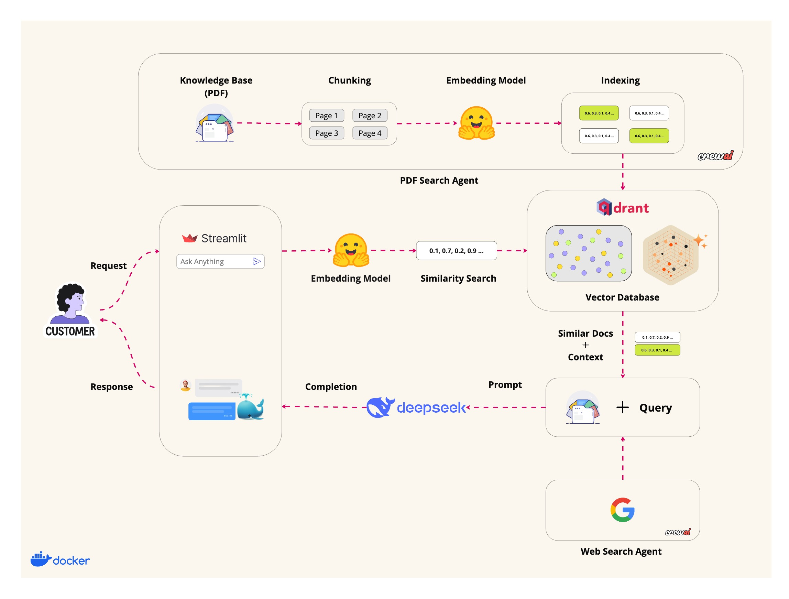

# Agentic RAG using DeepSeek

99% AI system don't make it to production because it lacks to provide tangible results. Thus sharing my latest project: **Agentic RAG using High Performance Vector Search powered by DeepSeek-r1** 🐳! 

## Demo

[](https://www.loom.com/embed/cc57d423ee7a4fcdaf6e84d3f9475cb2?sid=33f10be9-3c8f-4d28-8d32-c9cd6da37a0b)

**Objective:** 

In today's data-centric landscape, swift and precise access to information is paramount. This project is designed to streamline the retrieval of pertinent data from extensive document repositories, simplifying the search process for users and eliminating the need to sift through countless pages. By integrating cutting-edge AI technologies, this system boosts productivity and ensures users receive accurate responses to their inquiries.
This project leverages CrewAI to build an Agentic RAG that can search through your docs and fallback to web search in case it doesn't find the answer in the docs. It has the option to use either deep-seek-r1 or llama 3.2 that runs locally. More details in the Running the app section below!

## Signifance

1. Blazing fast hybrid search, 

2. < 3s latency,

3. Reduced hallucination because of multi agentic system 

4. Fully local

5. Dual-model architecture (DeepSeek-R1/Llama 3.2),

6. Full automated/efficient data pipelines using CrewAI,

7. Containerized solution with GPU-optimized Docker, can run on any system on planet earth.

## Architecture and Flow Diagram



## Installation and Setup

### Prerequisites

- Docker
- Docker Compose

### Steps

1. **Clone the repository**:

    ```sh
    git clone https://github.com/iaamar/deepseek-doc-chat.git
    cd deepseek-doc-chat
    ```

2. **Build and run the Docker container**:

    ```sh
    docker-compose up --build
    ```

3. **Access the application**:

    Open your web browser and navigate to `http://localhost:8501`.

### Running the App Locally

If you prefer to run the app locally without Docker, follow these steps:

1. **Install Dependencies**:

    Ensure you have Python 3.11 or later installed.

    ```sh
    pip install crewai crewai-tools semantic_text_splitter tokenizers markitdown qdrant-client fastembed
    ```

2. **Run the Streamlit app**:

    ```sh
    streamlit run app_deep_seek.py
    ```

## Project Structure

```plaintext
deepseek-doc-chat/
├── assets/
│   └── deepseek.png
├── src/
│   └── agentic_rag/
│       └── tools/
│           └── custom_tool.py
├── app_deep_seek.py
├── requirements.txt
├── Dockerfile
└── docker-compose.yml
```
